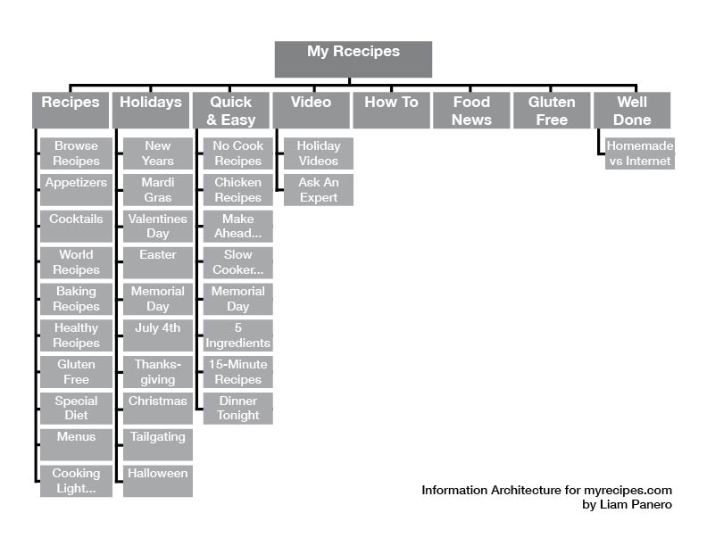
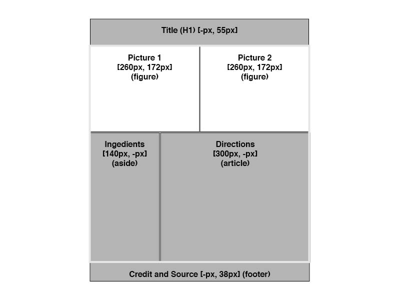

# Week 2 - WebDev Homework: Liam Panero

## Recipe Site Information Architecture:

## Reading Response:

'Well ya that makes sense' was my immediate thought after reading the article. The 5 suggested questions to ask at the prior to designing were particularly helpful as a gerneral starting point. In my own process I also include 'where am I/we ignorant?' 

## Wireframe For Recipe Page:

